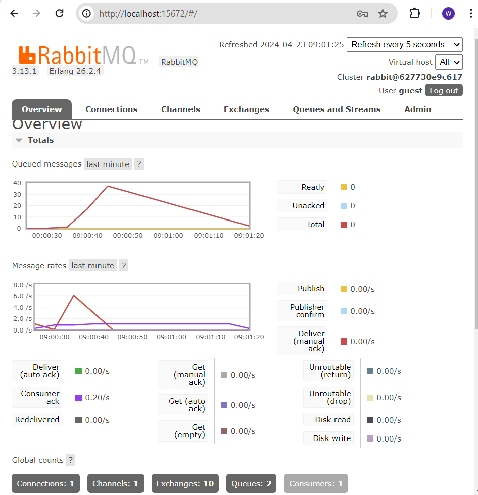

## Reflection Subscriber
1. What is amqp?
    - AMQP (Advanced Message Queueing Protocol) adalah sebuah protokol open standard application layer untuk message-oriented middleware. 

1. what it means? guest:guest@localhost:5672, what is the first quest, and what is the second guest, and what is localhost:5672 is for?
    - Hal ini berarti aplikasi-aplikasi client didesain untuk dapat berkomunikasi dengan aplikasi yang mengirimkan informasi. 
    - guest:guest merupakan username dan password yang digunakan agar dapat terautentikasi oleh server. Sedangkan localhost:5672 menunjukkan hostname yang di mana merupakan mesin lokal kita melalui port 5672.

# Image of Slow Subscriber

Explanation:
    -  Pada gambar diatas terjadi queue sekitar 37 kali. Hal ini disebabkan karena subscriber memerlukan waktu yang lebih lama untuk mengelola tiap event yang ada di dalam message queue sehingga lama kelamaan akan terjadi penumpukan message di dalam queue. Jika kita lihat kembali ke program,  publisher akan mengirimkan data ke meesage queue kemudian subscriber akan menerima dan menampilkannya. Tetapi, karena fungsi handle() dari subscriber memerlukan waktu yang lebih lama, maka pesan yang dikirimkan akan menumpuk tetapi waktu pemrosesan akan menjadi lebih lama.